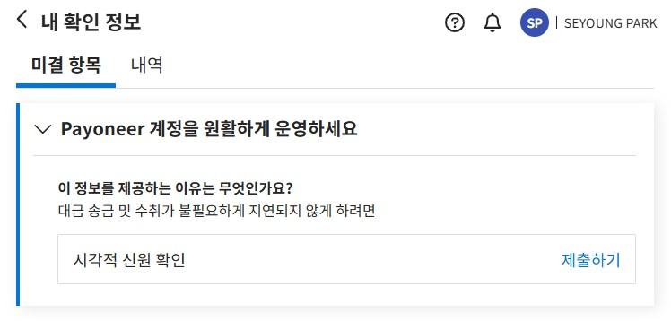
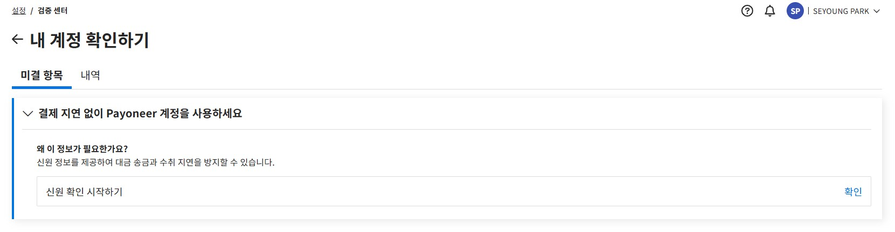

# B2B 결제 플랫폼: 계정 확인 화면 개선 사례

## Context
- 고객 신원 확인 절차를 안내하는 화면  
- 미완료 시 송금/결제 지연 위험 존재

## Before vs. After
| Before | After |
|--------|-------|
|  |  |

## 문구 수정 및 근거
| Before | After | Rationale |
|--------|-------|------------|
| 내 확인 정보 | 내 계정 확인하기 | 사용자의 행동을 명확히 표현 |
| Payoneer 계정을 원활하게 운영하세요 | 결제 지연 없이 Payoneer 계정을 사용하세요 | 직접적 이익 강조 |
| 이 정보를 제공하는 이유는 무엇인가요? | 왜 신원 정보가 필요한가요? | 간결성과 명확성 향상 |
| 대금 송금 및 수취가 불필요하게 지연되지 않게 하려면 | 신원 정보를 제공하여 지연을 방지할 수 있습니다. | 완전한 문장으로 신뢰성 강화 |
| 제출하기 | 확인 | 실제 액션(제출 아님)에 맞춰 수정 |

 

[목록으로 돌아가기](./index.md)
