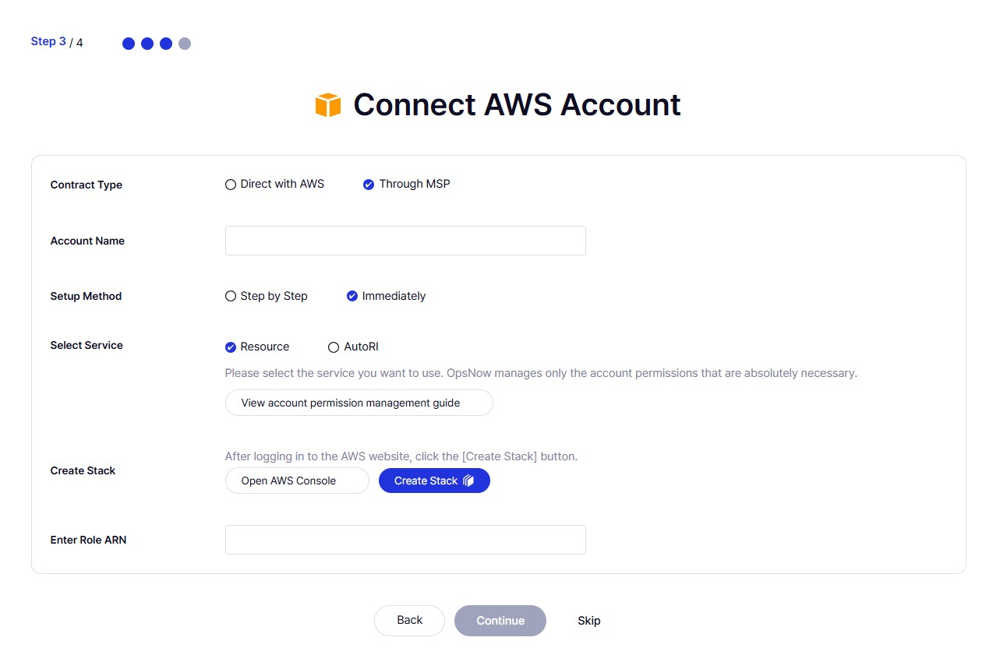

# 클라우드 관리 SaaS: 클라우드 계정 등록 화면 개선 사례

## Context
- 신규 사용자가 가입 직후 서비스를 시작할 수 있도록 계정 등록 화면을 온보딩에 통합  
- 복잡한 계정 등록 과정을 직관적으로 단순화함

## Before vs. After
| Before | After |
|--------|-------|
|  |  |

## Before - UX 이슈
- 화면 목적 불명확  
- 전문 용어 이해 어려움  
- 비직관적 동사 사용  
- 버튼/링크 시각적 부족

## After - UX 개선 사항
- 목적 명확화  
- 숙련 사용자 옵션 제공  
- 간결하고 명령형 중심의 문장 구성  
- 직관적 UI 텍스트로 가독성 향상
