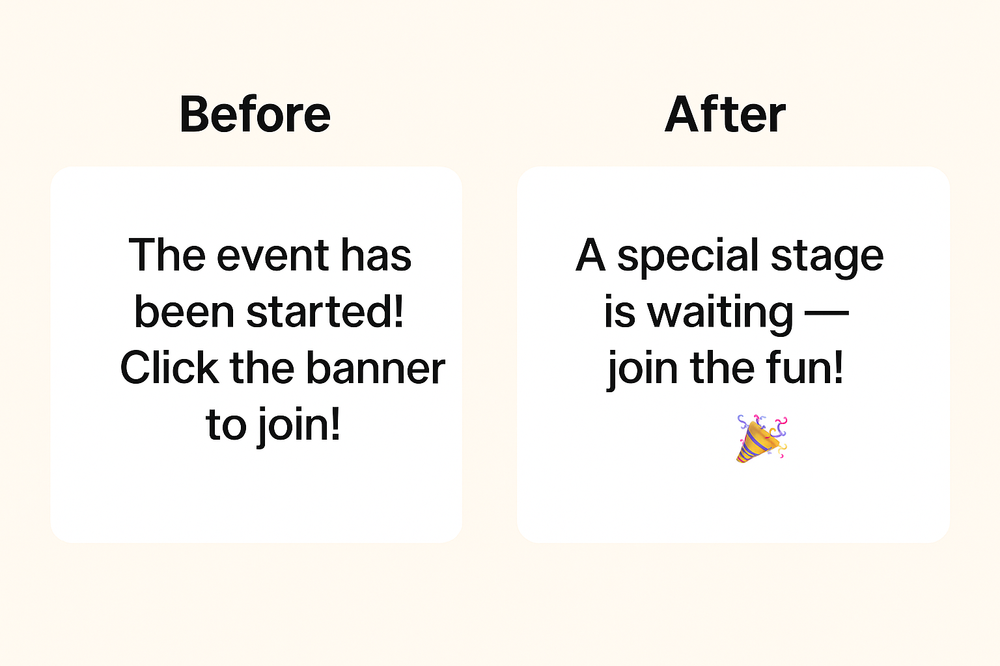

# 글로벌 엔터테인먼트 플랫폼 이벤트 알림 UX Writing 사례

## Context
- 정보 전달 중심의 번역투 문장을 브랜드 보이스에 맞는 메시지로 재작성함

## Before vs. After

## Before - UX 이슈
- 번역투 문장으로 자연스럽지 않은 흐름 (“has been started”, “Click the banner”)
- 기술적 지시문처럼 느껴져 참여 동기와 감정 연결 부족
- 브랜드 정체성과 어울리지 않는 건조한 공지 어조

## After - UX 개선 사항
- “A special stage is waiting”으로 기대감과 설렘 강화
- 🎉 이모지로 축제·무대 감성 시각화
- “join the fun!”으로 행동 유도 + 긍정적 에너지 전달  
- 팬덤 서비스에 맞는 밝고 포용적인 톤앤매너 확립

## 브랜드 보이스

| 항목                           | 내용                                                                                                                                                                                                   |
| ---------------------------- | ---------------------------------------------------------------------------------------------------------------------------------------------------------------------------------------------------- |
| **핵심 가치**       | 팬과 아티스트의 연결, 즐거운 참여                                                                                                                                                                                |
| **브랜드 성격**     | 활기찬 친구, 긍정적 에너지                                                                                                                                                                           |
| **언어 톤**     | 따뜻하고 유쾌하며 직관적                                                                                                                                                                              |
| **감정 목표**   | 기대감 유지, 신뢰감 확보, ‘지루하지 않은 기다림’ 제공                                                                                                                                                                     |
| **언어 예시** | “A special stage is waiting — join the fun! 🎉”, “Your favorite artist’s event just dropped! 💫”,  “Don’t miss the spotlight — it’s your turn to cheer! 🌈”                                                                                   |
| **보이스 특징**    | • 공지형 문구 대신 포용적이고 초대하는 느낌의 문장 사용  • “Click” “Participate” 등 기능어 대신 “join” “celebrate” 등 긍정적 동사 활용 • 짧고 리드미컬한 구조로 생동감 강화 • 🎉, 💖, 🌈 등의 이모지로 시각적 감성 표현 • 브랜드의 정체성을 반영한 밝고 팬 친화적 어조 유지 |

 

[목록으로 돌아가기](./index.md)
