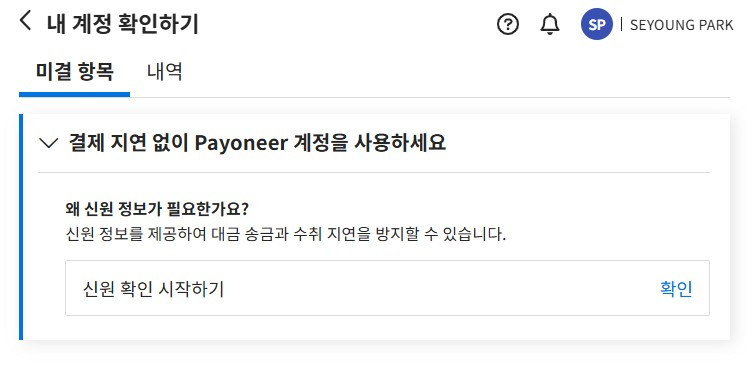

# UX Writing Samples

## 클라우드 관리 SaaS: 클라우드 계정 등록 화면 개선 사례

### Context

- 신규 사용자가 가입 직후 서비스를 시작할 수 있도록 기존의 클라우드 계정 등록 화면을 온보딩 화면에 배치함
- 복잡한 클라우드 계정 등록 화면을 보다 직관적으로 개편함

### Before vs. After

| Before | After |
|--------|-------|
|  |  |

### Before - UX 이슈

- 화면 목적 불명확: 클라우드 계정 연결 화면이라는 점이 직관적으로 드러나지 않음
- 단어 이해 어려움: Manually vs Automatically 차이를 쉽게 구분하기 어려움
- 비직관적 동사 사용: Creating 대신 Create와 같은 명령형이 더 직관적임
- 버튼/링크 표현 부족: See how to create role ARN automatically in AWS → 문장이 장황하고 버튼처럼 보이지 않음

### After - UX 개선 사항

- 목적 명확화: 화면 상단에 클라우드 계정 연결이라는 목적을 명시함
- 숙련 사용자 배려: 프로세스에 익숙한 사용자가 가이드를 거치지 않고 빠르게 정보를 입력할 수 있는 옵션(Step by Step/Immediately)을 제공하고 직관적인 표현을 사용함
- 간결하고 직관적인 언어: 기존 직역투 문구를 개선하여 짧고 이해하기 쉬운 문장을 사용함
- 명령형 동사 사용: Create, Connect 등 명령형을 활용해 가독성을 개선함

---

## B2B 결제 플랫폼: 계정 확인 화면 개선 사례

### Context
- 고객 신원 확인 절차의 일부로 신원 정보를 제출하도록 안내하는 화면
- 신원 확인이 완료되지 않으면 송금/결제 지연 가능성 존재

### Before vs. After

| Before | After |
|--------|-------|
|  |  |

### 문구 수정 및 근거 

| Before | After | Rationale |
|--------|-------|---------------------------------------------|
| 내 확인 정보 | 내 계정 확인하기 | 사용자가 수행하는 행동을 명확히 전달 |
| Payoneer 계정을 원활하게 운영하세요 | 결제 지연 없이 Payoneer 계정을 사용하세요 | 사용자가 얻는 직접적인 이익을 강조하여 동기 부여 |
| 이 정보를 제공하는 이유는 무엇인가요? | 왜 신원 정보가 필요한가요? | 구체적인 정보를 포함하고 간결한 언어를 사용하여 메시지의 명확성과 가독성 향상 |
| 대금 송금 및 수취가 불필요하게 지연되지 않게 하려면 | 신원 정보를 제공하여 대금 송금과 수취 지연을 방지할 수 있습니다. | 완전한 문장 사용으로 메시지의 명확성과 신뢰성 강화 |
| 제출하기 | 확인 | 버튼을 클릭 시 정보를 제출하는 것이 아니므로 '신원 확인 시작하기'에서 프로세스가 연결되도록 수정 |

---

## 클라우드 관리 SaaS: 클라우드 관리 대시보드 UX Writing 사례

### Overview

클라우드 비용, 자산, 보안, 거버넌스 현황을 한 눈에 볼 수 있는 통합 대시보드

### Tone & Manner

데이터 중심의 전문적이고 간결한 소통으로 사용자에게 신뢰감을 주는 톤 앤 매너를 유지

### UX Writing Highlights

- 짧고 명확한 레이블
- 데이터와 단위를 결합하여 직관적 수치 표현
- 맥락 이해를 위한 보조 설명(예: 이번 달 사용 비용(09/01~09/20))

### 의도한 UX 효과

- **신뢰성**: 불필요한 수식어 없이 데이터 중심 전달
- **효율성**: 짧은 레이블로 빠르게 이해 가능
- **전문성**: B2B SaaS 서비스에 맞는 중립적이고 전문적인 문체

