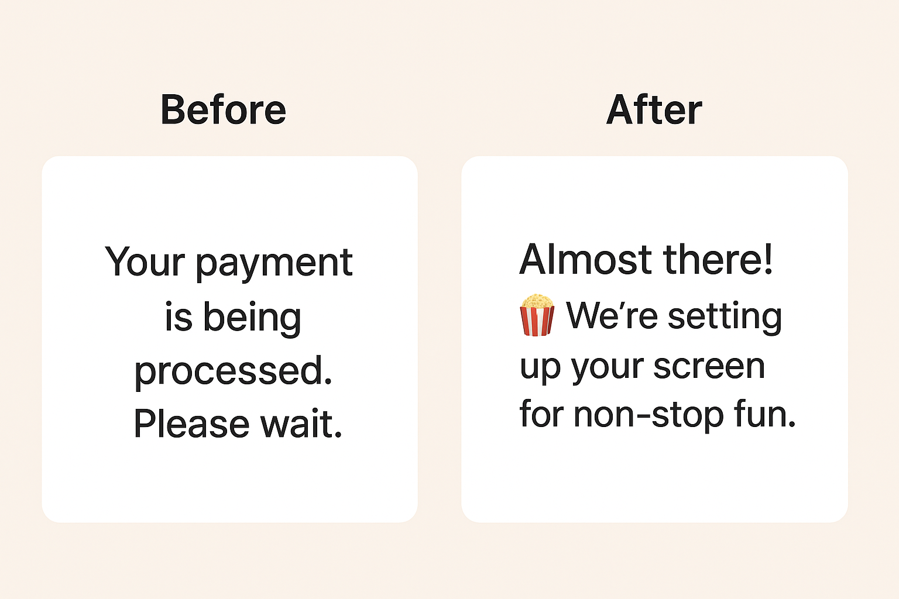

# 글로벌 OTT 서비스 결제 대기 화면 UX Writing 사례

## Context
- 글로벌 OTT 서비스의 결제 대기 화면도 콘텐츠 경험의 일부로 느낄 수 있도록 UX 문구를 개선함

## Before vs. After

## Before - UX 이슈
- 기술 중심 표현으로 감정적 여정 단절
- 브랜드 감성 부족  
- 기대감 저하  

## After - UX 개선 사항
- “Almost there!”로 사용자 중심 전환  
- 🍿 이모지로 엔터테인먼트 감성 강화  
- “non-stop fun”으로 결제 후 기대감 유지  
- 글로벌 서비스에 맞는 밝고 친근한 톤앤매너 확립

## 브랜드 보이스

| 항목                           | 내용                                                                                                                                                                                                   |
| ---------------------------- | ---------------------------------------------------------------------------------------------------------------------------------------------------------------------------------------------------- |
| **핵심 가치**       | 즐거운 순간의 연결, 기다림마저 긍정적인 경험으로 만드는 태도                                                                                                                                                                                |
| **브랜드 성격**     | 유쾌하고 여유로운 동반자, 즐거움을 나누는 친구                                                                                                                                                                           |
| **언어 톤**     | 밝고 따뜻하며, 긍정적이고 위트 있는 어조                                                                                                                                                                              |
| **감정 목표**   | 기대감 유지, 신뢰감 확보, ‘지루하지 않은 기다림’ 제공                                                                                                                                                                     |
| **언어 예시** | “Almost there!”, “🍿 We’re setting up your screen for non-stop fun.”, “Hang tight — the fun’s about to begin!”                                                                                       |
| **보이스 특징**    | • 기술적 문구 대신 감정 중심 언어 사용 • 사용자의 시간을 존중하며 “기다림”을 긍정적으로 재해석 • 짧고 리드미컬한 문장으로 경쾌한 템포 유지 • 🍿, 🎬 등 콘텐츠 연상 이모지로 브랜드 감성 강화 • “Please wait” 대신 ‘함께 기대하는’ 톤으로 표현 (“Almost there!”, “Hang tight!”) |

 

[목록으로 돌아가기](./index.md)
