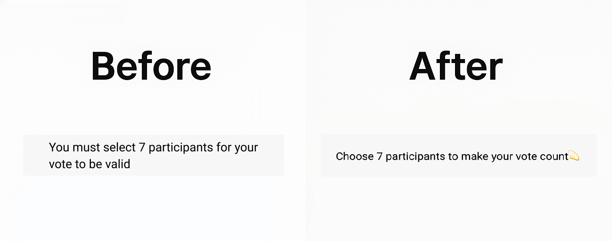

# 글로벌 엔터테인먼트 플랫폼 투표 규칙 안내 화면 개선

## Context
- 기존의 행정적인 규정 중심 문장을 브랜드 톤에 맞는 감성적·유도형 어조로 전환함  

## Before vs. After

## Before - UX 이슈
- “You must…”로 시작하는 명령형 문장이 사용자에게 부담감 부여  
- “valid”와 같은 형식적 단어 사용으로 브랜드 감성 단절  
- 규칙 설명 중심이라 팬 경험과의 연결 약화  
- 정보는 정확하지만 참여 동기·감정 연결 부족

## After - UX 개선 사항
- “Choose”로 어조를 부드럽게 전환, 사용자 주도형 경험 강조
- “make your vote count 💫”로 참여 가치 강화  
- 글로벌 사용자에게 자연스럽고 친근한 브랜드 톤 확립

## 브랜드 보이스

| 요소 | 정의 |
|------|------|
| 핵심 가치| 팬과 아티스트의 연결, 즐거운 참여 |
| 브랜드 성격 | 유쾌하고 여유로운 동반자, 긍정적 에너지 |
| 언어 톤 | 따뜻하고 명확하며 격식보다 감정 중심 |
| 감정 목표 | 사용자가 “규칙을 따르는 사람”이 아니라 “응원에 참여하는 사람”으로 느끼게 함 |
| 언어 예시 | “Choose 7 participants to make your vote count 💫”, “Every cheer makes a difference 🌟”,  “Your support keeps the stage alive 🎤” |
| 보이스 특징 | • 규칙 안내도 감정 중심 어조로 표현 • “must / valid” 등 강제 표현 대신 긍정적 행동 유도 동사(choose / make / cheer) 사용 • 짧고 리듬감 있는 문장 구성 • 💫✨🎤 등 감정 표현 이모지로 브랜드 톤 강화 |

 

[목록으로 돌아가기](./index.md)
