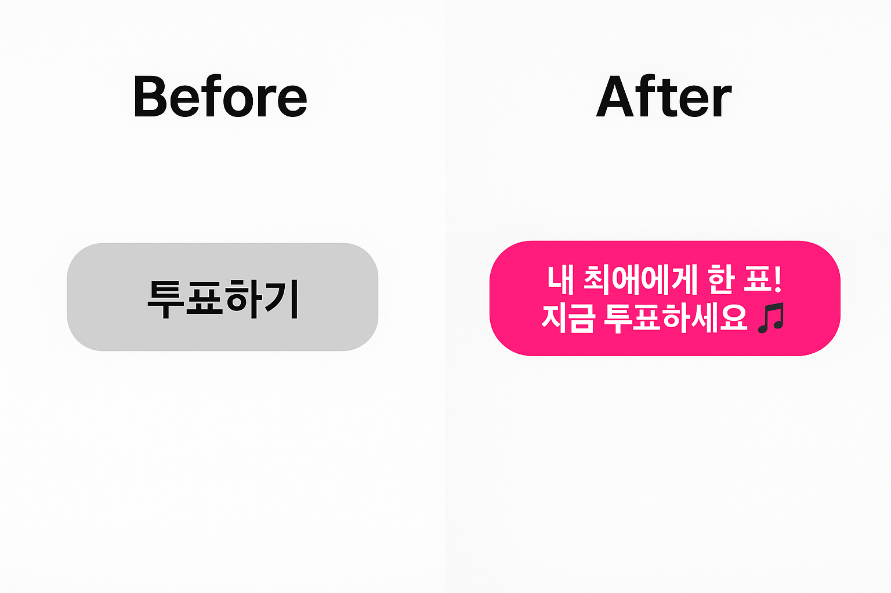
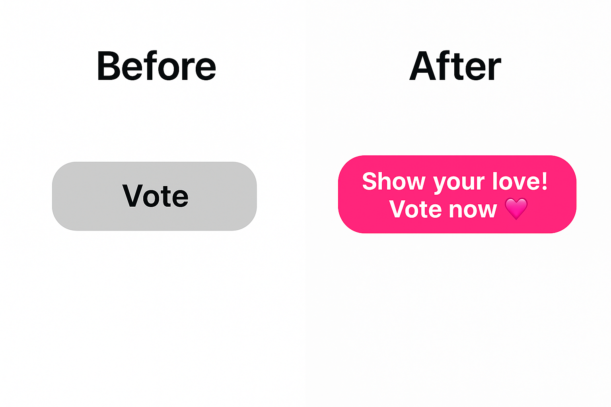

# 글로벌 엔터테인먼트 플랫폼 투표 화면 UX Writing 사례

## Context
- 글로벌 엔터테인먼트 플랫폼의 투표 화면에서 사용자가 참여 동기를 느낄 수 있도록 UX 문구를 개선함

## Before vs. After

## Before - UX 이슈
- 단조로운 명령형 표현 (“Vote”)으로 참여 유도력이 낮음
- 서비스 개성 및 브랜드 감성 부재
- 행동 유도 대신 정보 전달에 그침, 클릭 동기 약화  

## After - UX 개선 사항
- 팬들의 감정에 공감하는 표현 사용
- 이모지로 밝고 즐거운 분위기 강화
- 문장형 카피로 행동 장려 및 친근한 어조 확보
- 글로벌 사용자에게 통하는 밝고 긍정적인 톤앤매너 정착

## 브랜드 보이스

| 요소     | 정의                                                            |
| ------ | ------------------------------------------------------------- |
| 핵심 가치  | 팬과 아티스트의 연결, 즐거운 참여                                           |
| 브랜드 성격 | 활기찬 친구, 긍정적 에너지                                               |
| 언어 톤   | 따뜻하고 유쾌하며 직관적                                                 |
| 감정 목표  | 설렘과 소속감                                                       |
| 언어 예시  | “Show your love!”, “Let’s cheer together!”, "One vote, all the love 💕" |
| 특징 | • 사용자를 ‘참여자’로 존중하며 말함 • 짧고 리듬감 있는 문장 구성 • 감정 표현에 이모지 적극 활용 💖🎵 • 직접적 행동 유도(“Vote now!” “Join the fun!”) • 명령보다는 초대의 어조로 전달 (“Let’s…” “Come join…”) |

 

[목록으로 돌아가기](./index.md)
