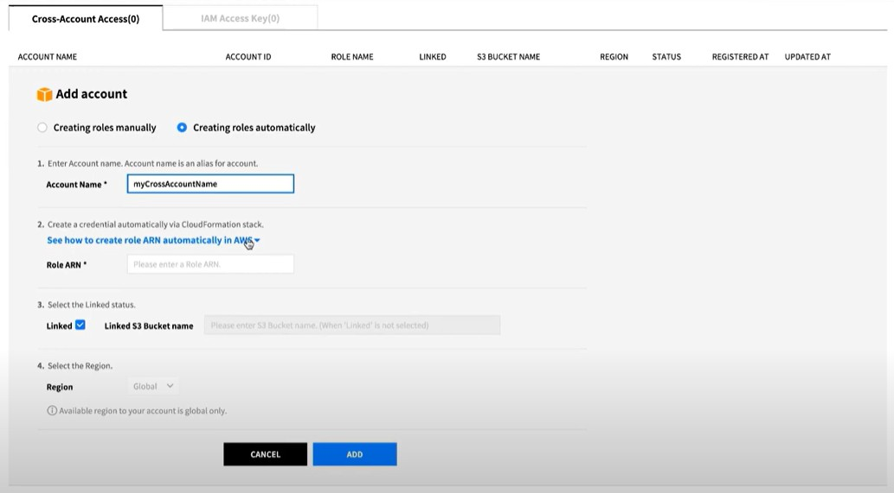
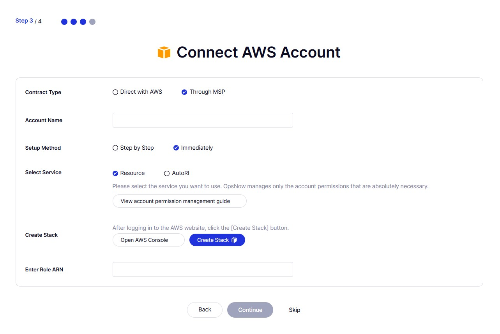
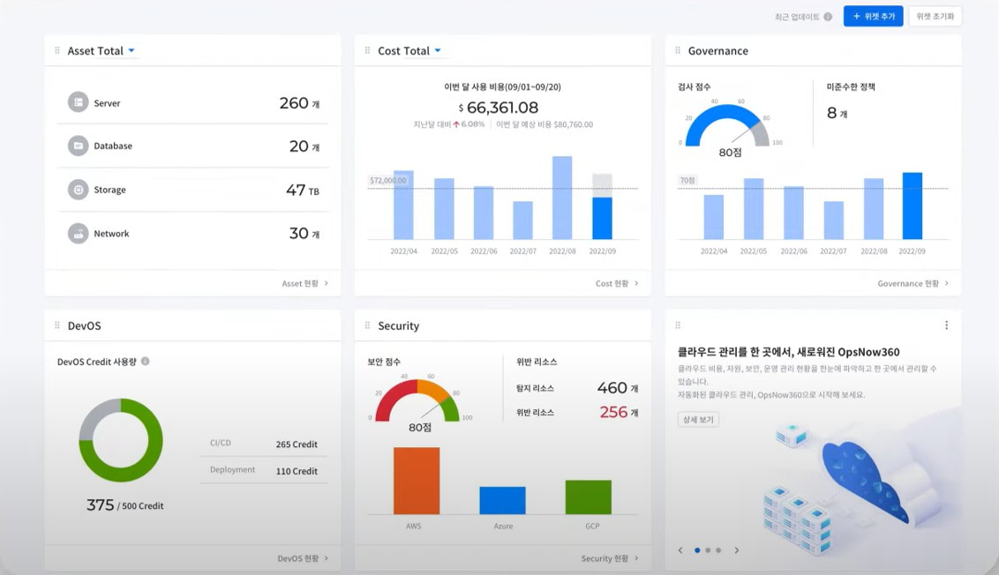

# UX Writing Samples

## 클라우드 관리 SaaS: 클라우드 계정 등록 화면

### Context

- 신규 사용자가 직후 서비스를 시작할 수 있도록 기존의 클라우드 계정 등록 화면을 온보딩 화면에 배치함
- 복잡한 클라우드 계정 등록 화면을 보다 직관적으로 개편함

### Before vs. After

| Before | After |
|--------|-------|
|  |  |

### Before - UX 이슈

- 화면 목적 불명확: 클라우드 계정 연결 화면이라는 점이 직관적으로 드러나지 않음
- 단어 이해 어려움: Manually vs Automatically 차이를 쉽게 구분하기 어려움
- 비직관적 동사 사용: Creating 대신 Create와 같은 명령형이 더 직관적임
- 버튼/링크 표현 부족: See how to create role ARN automatically in AWS → 문장이 장황하고 버튼처럼 보이지 않음

### After - UX 개선 사항

- 목적 명확화: 화면 상단에 클라우드 계정 연결이라는 목적을 명시함
- 숙련 사용자 배려: 프로세스에 익숙한 사용자가 가이드를 거치지 않고 빠르게 정보를 입력할 수 있는 옵션(Step by Step/Immediately)을 제공하고 직관적인 표현을 사용함
- 간결하고 직관적인 언어: 기존 직역투 문구를 개선하여 짧고 이해하기 쉬운 문장을 사용함
- 명령형 동사 사용: Create, Connect 등 명령형을 활용해 가독성을 개선함

---

## 클라우드 관리 SaaS: 클라우드 관리 대시보드

### Tone & Manner

데이터 중심의 전문적이고 간결한 소통으로 사용자에게 신뢰감을 주는 톤 앤 매너를 유지함

